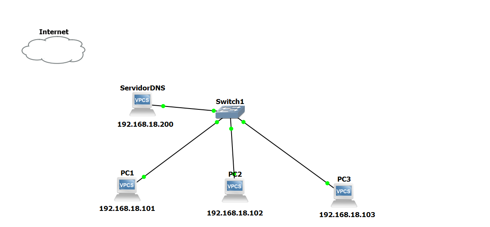
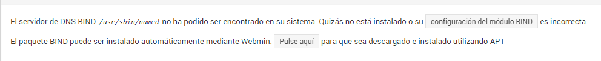
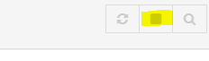

# Instalacion
Teniendo el siguente esquema de red, instala el servidor dns en webmin

Para hacer este ejercicio utilizaremos el sistema operativo de Ubuntu Server:

1-Primero buscaremos dns webmin y instalaremos el bind9 dandole clicando en "pulse aqui" y instalar.

2-Despues vamos a crear una zona de busqueda directa.

Imagen con los pasos para crear la zona

3-Ahora reiniciamos el servidor con las siguentes opciones que se encuentran arriva a la derecha de la pantalla, lo paramos y lo reiniciamos.

4-Comprobamos con el comando "nslookup(nombre del servidor)" que resuelva consultas.

imagen del uso del comando

5-Luego con el comando "sudo gedit(ruta del archivo)" comprobamos el archivo log(/var/log) y el contenido del archivo named.conf.local.

imagen del uso 

[Volver a la pagina pricipal](README.md)
