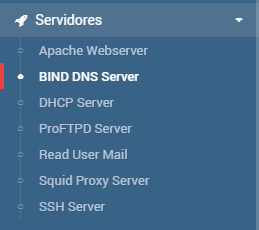

# Instalacion
Teniendo el siguente esquema de red, instala el servidor dns en webmin

Para hacer este ejercicio utilizaremos el sistema operativo de Ubuntu Server:

1-Primero buscaremos dns webmin y instalaremos el bind9 dandole clicando en "pulse aqui" y instalar.

2-Ahora reiniciamos el servidor con las siguentes opciones que se encuentran arriva a la derecha de la pantalla, lo paramos y lo iniciamos.

    

Donde creas la zona de busqueda directa pones 

Esta zona resolvera nombres de dominio como www.google.com a ips 217.163.17.9

en la inversa lo mismo pero al contario

Esta zona resuelve direcciones ip 217.163.17.9 a nombre de dominio www.google.com

[Volver a la pagina pricipal](README.md)
